# Welcome

Welcome to the serverless workshop. Herer we will practice some common concepts of serverless architecture as well as review some of the common use cases

# What is Serverless

Core of serverless architectures is so called FaaS (Function as a Servie).
Which is a lightweight container that contains OS and Runtime and has been attached to the code baseline (FaaS code). Main benefit: it is only takes few milliseconds to spin up a new contaner instance that will execute code functioun attached to it. If it only takes few milliseconds why should we run it all the time? What if Cloud Provider will keep container disabled (you will not pay) and only spin it when certain event will happen and let the code inside of the container to react (be executed, triggered by event).

So, in difference to VMs you pay only for every 100milliseconds of execution instead of paying by hour. Sounds great, isn't it? Where is the catch? 

And yes there is a catch. Serverless Architecture comes with some limitations. So you need to think on architecture design how to dodge it. But, if ycan get savings up to 100 and more times if you design properly.

This workshop will highlight some of the AWS (They far are leading in serverless computing) Lamba service specifics and will give you possibility to try by yourself what works good what for you.

More details about Serverless you will get in the first Lab

# Tools we use

We need to have a comprehensive toolset of the tools to do development for serverless. We will use the following:

- *AWS*: cloud native services of Amazon Web Services. They are far behind of Google and Microsoft (in terms of maturity of cloud services for serverless )

- *Terraform*: FaaS does not live in the vacuum. In order it to exist it needs to operatie with other cloud resources such as: storage, security, networking, eetc. So, instead of single FaaS (AWS Lambda) we need to deploy a stack of interconnected cloud resources. Terraform a "Mercedes" of the stacks provisioning. It's capabiilties goes beyond similar service from Amazon.

- *Python 2.7*: You don't need to be an expert of Python to complete this workshop however some programming experience (any language is good) can be be efitial. We have choisen Python because it is easier to illustrate some of the FaaS concepts rather than other language runtimes (such as: nodejs or Java)

- *CMake*: After spending some time with tons of differnet build tools. Author decided to pick CMake as a canonical build tool. It is less opiniated and well know for few decades (+ easy to learn)


# Lifecicle of the CMake

Well, CMake is probably easiest tool you can imagine. Everything has been expressed in `Makefile`. It should be operated from the same directory where `Makefile` exists. You need to run `make <tsk-name>` and that's it. \

Here are our tasks. As you will see (check the `Makefile`) it wraps some terraform commands, so you would have better user experience.

`plan` - this task allows to build deployment plan for Terraform

`deploy` - this applies deployment plan built by previous command

`all` - combines both tasks (this also a default task for makefile)

`destroy` - deletes stack that has been built with Terraform


# LAB - 0: prep the environment

There are two options how to use this workshop. 
1. Bring your own AWS. This will not going to cost you much. We estimate the whole workhop will cost less than 1USD. Your own cloud environment will guarantee that you are working on isolated from the other users environment wihtout risk of interference

2. User shared environment provided by us. Please be respectful to tother colleagues, don't kill other's stuff... Be careful to your's and it's all going to be just fine

If you use your own cloud then many steps from this tutororial can be skipped.

### Setting up Terraform variables

Choose a good name. Please note, the name for your environment needs to be unique but distinctive. It needs to be "small letters and dash separated"

Once you are ready: create a Terraform variables file: `terraform.tfvars`

```
name = "your-wonderful-name"
aws_region = "eu-west-1"
aws_profile = "default"
```

Make shure you have Terraform available in the PATH environment variable:

- You already have Terraform instlled (v0.7.2 and later). 
- Download one from (http://terraform.io/downloads.html)
- Copy from USB stick

If you want to run Terraform from your custom location, then please adjust `Makefile` (line # 8 to point to terraform alternative location)

By completion you should ber abe to run terraform via `Makefile`. Run following command:

`make all`

Waring Bug ahead: If terraform provisioning fails with error: 

```
aws_api_gateway_deployment.prod: Error creating API Gateway Deployment: BadRequestException: No integration defined for method
    status code: 400, request id: 6b25f33c-c04e-11e6-9ee2-7525de577dec
```

Down't worry. Wait 30 seconds to allow API Gateway to settle down and then run `make all` command again.

After completion you should be able to see creted resources by terraform. Pleaser put note of Terrform output, we are going to need it later.

Example of Terraform output

```
api_gateway_url = https://meo41ti2r7.execute-api.eu-west-1.amazonaws.com/prod
kms_arn = arn:aws:kms:eu-west-1:111222333444:key/0caebd58-5cec-4499-89cb-03eda35774e5
lambda_arn_01_new_game = arn:aws:lambda:eu-west-1:111222333444:function:my-environment-name-new-game
lambda_arn_02_check_game_state = arn:aws:lambda:eu-west-1:111222333444:function:my-environment-name-game-state
lambda_arn_03_night_murder = arn:aws:lambda:eu-west-1:111222333444:function:my-environment-name-night-murder
lambda_arn_04_daily_accusation = arn:aws:lambda:eu-west-1:111222333444:function:my-environment-name-day-accusation
lambda_arn_05_user_judgement = arn:aws:lambda:eu-west-1:111222333444:function:my-environment-name-user-judgement
role_arn = arn:aws:iam::111222333444:role/role-00688b5357814c9474f5424323
role_name = role-00688b5357814c9474f5424323
```

If you missed outputs. You can always run: `make out` to see outputs again.

If you messed up enironment. Run the following
```
make destroy
make all
```

You should be able to get initial state of your environment

### LAB 01: Getting started with AWS Lambda

1. With your Internet Browser. Connect to AWS Web Console [here](http://akranga.signin.aws.amazon.com/console?region=eu-west-1) or to your own Cloud Account.

2. Switch to the region Ireland (eu-west-1). Since now we will presume you are located in the Ireland region. All links will be to this region. If you decided to go to the other region, you might want to adjust direct links to your desired region.

3. Switch to AWS Lambda service: [direct link](https://eu-central-1.console.aws.amazon.com/lambda/home?region=eu-west-1)

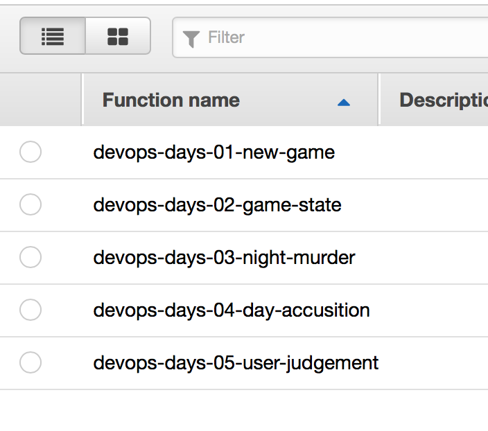

4. Select lambda function that has been tagged as `your-environment-name-01-new-game` 

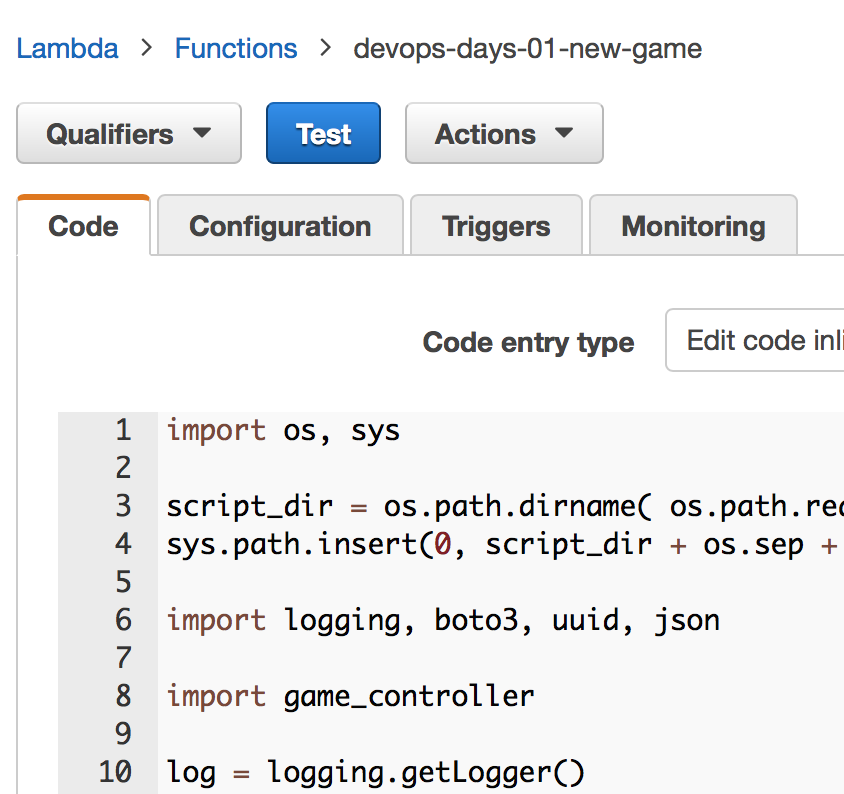

You will see several tabs. Let me guide through these it:
- *Code*: this tab shall be used to modify the code. Configuration management parameters can be injected via Environment Variables (scroll down)

- *Configuration*: This tab has been used to customize this Lambda function. Probably ost importaant text field is: Handler. It looks like the following: `main.new_game_handler`. Where, first part corresponds to the source code file name and second part is the name of the function to be executed.

Advanced settings also contains: RAM and Timeout constraints for this lambda function

- *Triggers*: here you can customize event source for the Lambda function (we will come back here in further Labs)

- *Monitoring*: contains reference to the LambdaFunction CloudWatch Logs. AWS Lmbda has no remote debugger functionality. So, logs become vitally important

On top left you will also find few buttons. Click on blue `Test` button. For the first time you should be able to see dialog to configure test event. It must be expressed in valid JSON format. Empty event looks like on the picture (`{}`) below. And then click "Save and Test" button (bottom right corner).

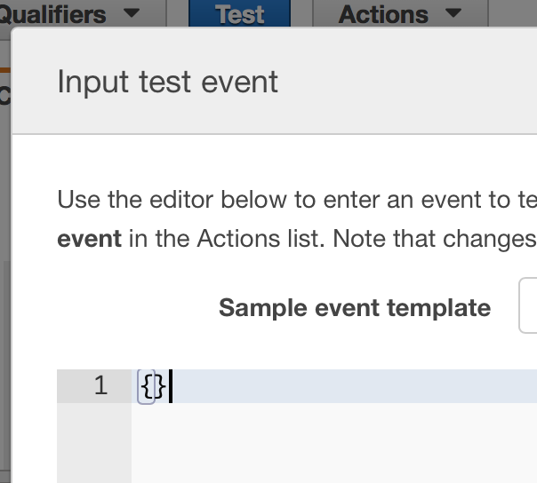

If execution has been completed successfully you shouls see. Result message, and function logs as well as used RAM and Function time statistics

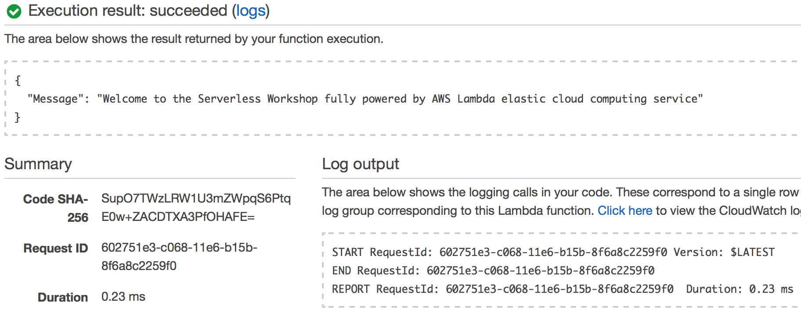

### LAB 01.2: Modify behaviour of Lambda function

Knowing how to change code and test it, let's implement `new_game_handler` function. We should be able to create create a new game (gererate Players and assign Mafia identities to them). Because we don't want to reveal players identity to the User (remember Lambda is stateless) we are going to add backend database table to our AWS Lambda. We shall use it as cache to make sure our data survive Lambda container restart. But first let's start with the behavour of the `new_game_handler` function

Change imlementation to code that looks like below:
```python
def new_game_handler(event, context):
  game = {
    'GameId':     str(uuid.uuid1()),
    'Players':    game_controller.new_game(),
    'LastAction': 'new', 
    'Result':     'unknown'
  }

  names = [ player['Name'] for player in game['Players'] ]
  message = "New game started with {}".format(', '.join(names))
  return response( {"message": message}, event)
```

For your convinience. Mafia game control logic has been already implemen ted in file `game_controller.py` which is imported in the beginning of the file

Click `Save` button and then click `Test` button.

You should bet something like:
```javascript
{
  "message": "New game started with Christopher, Adam, Kevin, Brenda, Nicholas"
}
```
Where names are randomly selected player names. Few of them are `innocent` others hide `mafia` identity.

Let's add a database. If you will scroll down, you will find that Environment Variable `dynamo_table` has been set to the DynamoDB table name (that happend during provisioning with Terraform).

Let's initialize this table by placing code (just below log inicialization).
```python
log = logging.getLogger()
log.setLevel(logging.DEBUG)

dynamodb = boto3.resource('dynamodb')
table = dynamodb.Table(os.environ['dynamo_table'])
```

And let's implement Dynamo DB CRUD functions.
```python
def flush_old_game():
  resp = table.scan() 
  for i in resp['Items']:
    table.delete_item(Key={'GameId': i['GameId']})


def save_game(current_state):
  table.put_item(Item=current_state)


def load_game():
  resp = table.scan(Limit=1)
  if resp['Count'] > 0:
    return resp['Items'][0]

  return {
    'GameId':     'game not started',
    'Players':    [],
    'LastAction': 'game not started', 
    'Result':     'game not started'
  }
```

Please modify `new_game_handler` function so it would now include DB functions. You should get something like the follwing:

```python
def new_game_handler(event, context):
  game = {
    'GameId':     str(uuid.uuid1()),
    'Players':    game_controller.new_game(),
    'LastAction': 'new', 
    'Result':     'unknown'
  }
  flush_old_game()
  save_game(game)
  names = [ player['Name'] for player in game['Players'] ]
  message = "New game started with {}".format(', '.join(names))
  return response( {"message": message}, event)
```

Checking the data. We can switch to the `DynamoDB` service by following this [link](https://eu-west-1.console.aws.amazon.com/dynamodb/home?region=eu-west-1)

Navigate to the database that has been propogated to the Lambda function through the environment variable. `make out` can help to navigate the command

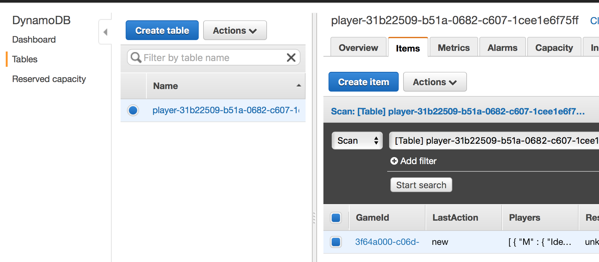

You can drill down to the data 

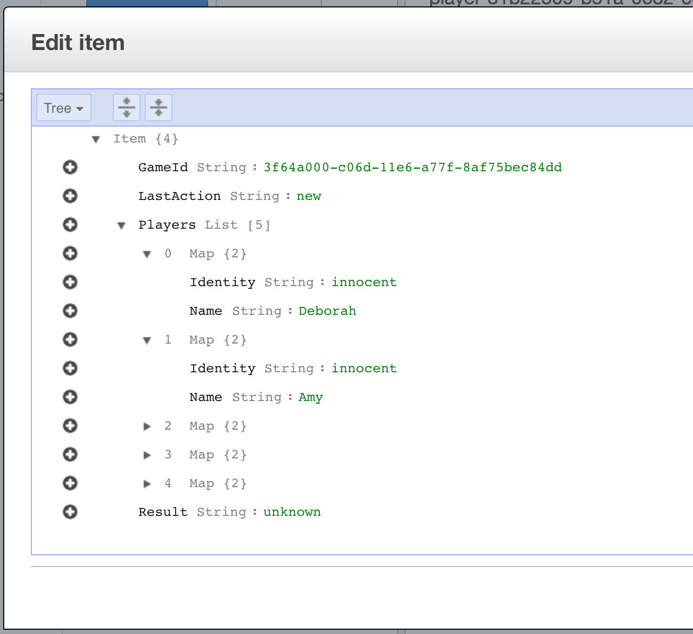

### LAB 01.2: Add behavior to the game_state_handler function

In a similar manner let's come back to our lambda functions [link](http://akranga.signin.aws.amazon.com/console?region=eu-west-1)


Now let's select function `your-environment-name-02-game-state`

Before we try to modify this function, let's make shure it works. Click "Test"button and end "empty" (`{}`) as Test Input Message. If you see the same  as on the screenshot below...


...then you feel free to proceed with this activity. Otherwise you might want to correct error first.

!!! Please apply same modifications as they were for for *LAB 01.1* and then add the following 

```python
def game_state_handler(event, context):
  game = load_game()
  players = game['Players']
  game_controller.hide_uncovered_identities( players )
  return response(game, event)
```

Then click "Test". You shuld see function execution successfull otherwise you might want to correct an error.

### LAB 01.3: Add behavior to night_murder function

Based on what you learned in *LAB 01.1* and *LAB 01.2*
let's modify all other functions. (!!! Don't forget to propogate DB shared functions)

And Lambda implementation code:
```python
def night_handler(event, context):
  game = load_game()
  players = game['Players']

  victim = game_controller.victim_of_mafia(players)

  players[victim]['Identity'] = 'killed'
  game['LastAction']          = 'night murder'

  save_game(game)
  return response( {"Message": [
      "Night, time to sleep",
      "Mafia awaken",
      "Mafia kills {}".format(players[victim]['Name']),
      "Mafia sleeps"
    ]}, event)
```

Uppon successful execution you should see something like this
```javascript
{
  "Message": [
    "Night, time to sleep",
    "Mafia awaken",
    "Mafia kills Deborah",
    "Mafia sleeps"
  ]
}
```

### LAB 01.4: Add behavior to daily_accusation function

Very similar to previous ones:
```python
def day_handler(event, context):
  game = load_game()
  players = game['Players']
  accusations = game_controller.get_players_accusations(players)
  game['LastAction'] = 'day accusations'
  return response( {"Message": ["Day, time to awaken"
                                "Players accuse each other"] 
                                + accusations + 
                               ["Who is the guilty?"] }, event)

```

And successful execution result should look like this
```javascript
{
  "Message": [
    "Day, time to awakenPlayers accuse each other",
    "Deborah is dead",
    "Amy accuses Gregory",
    "Brandon accuses Brandon",
    "Dennis accuses Amy",
    "Gregory accuses Amy",
    "Who is the guilty?"
  ]
}
```

### LAB 01.5: Add behavior to judgement function

Propogate DB shared functions and lambda handler
```python
def judgement_handler(event, context):
  log.debug(json.dumps(event, separators=(',', ':')))

  accused_player = event['queryStringParameters']['player']

  game    = load_game()

  players = game['Players']

  accused = game_controller.find_by_name(players, accused_player)
  if accused == None:
    return response( {"Message": "Sorry player {} not found".format(accused_player)}, event, 404)

  sentensed = players[accused]
  if sentensed['Identity'] == 'mafia':
    sentensed['Identity'] = 'Sentensed, guilty!'
    sentence = "{} is guilty!".format(sentensed['Name'])
  elif sentensed['Identity'] == 'innocent':
    sentensed['Identity'] = 'Sentensed, not guilty!'
    sentence = "{} is not guilty!".format(sentensed['Name'])
  else:
    return response( {"Message": "Sorry player {} is {} ".format(accused_player, sentensed['Identity'])}, event, 403) 

  game['LastAction'] = 'judgement'
  save_game(game)

  return response( {"Message": [
      "{} has been accused".format(sentensed['Name']),
      "Plyers identity has been revealed",
      sentence
    ]}, event)
```

But you will see this function relies on user argument that comes with event
```javascript
{
  "body": "{\"Message\":[\"Amy has been accused\",\"Plyers identity has been revealed\",\"Amy is not guilty!\"]}",
  "headers": {},
  "statusCode": 200
}
```

# LAB 2 Create an API

We created few AWS Lambdas now let's expose it to the users so they can access it. For this purpose we need an API Gateway Service that will encapsulate AWS lambdas behind REST interface and will privide convinient endpoints

With our terraform script. We already created an instance of AWS API Gateway

We will use only `open` (unsecured) endpoints today.

Before we start just check your API ednpoint name

Run following command

```
$ make out

Outputs:

api_gateway_name = api.devops-days
api_gateway_url = https://mzckcf11cd.execute-api.eu-west-1.amazonaws.com/prod
```

1. Go to AWS Lambda service: [direct link](https://eu-central-1.console.aws.amazon.com/lambda/home?region=eu-west-1)

2. Select lambda function that has been tagged as `your-environment-name-01-new-game` 


3. Switch to 'Triggers' tab and press "Add new trigger"

4. Click on "dotted square" on the left from AWS Lambda icon (see screenshot below) and select API Gateway

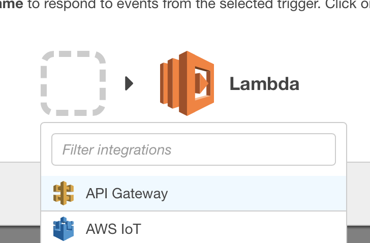

5. In the new dialog:
    * API name: select your API gateway (terraform output should help to find your).
    * Deployment stage: prod
    * Security: open

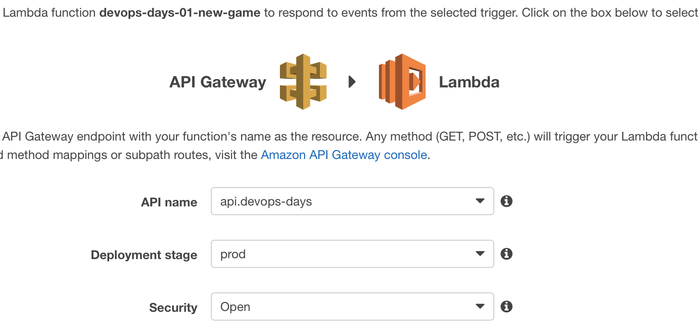

6. By the completion of this step you should see someting like below:

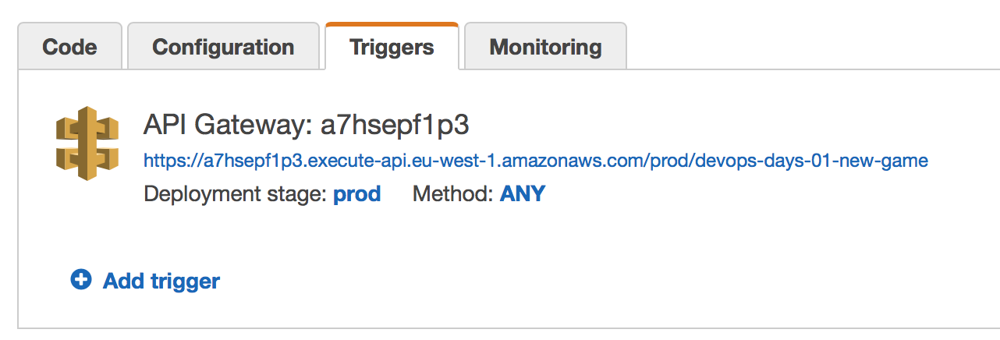

7. Now switch to API Gateway service: [link](https://eu-west-1.console.aws.amazon.com/apigateway/home?region=eu-west-1#/apis)

8. Select your API

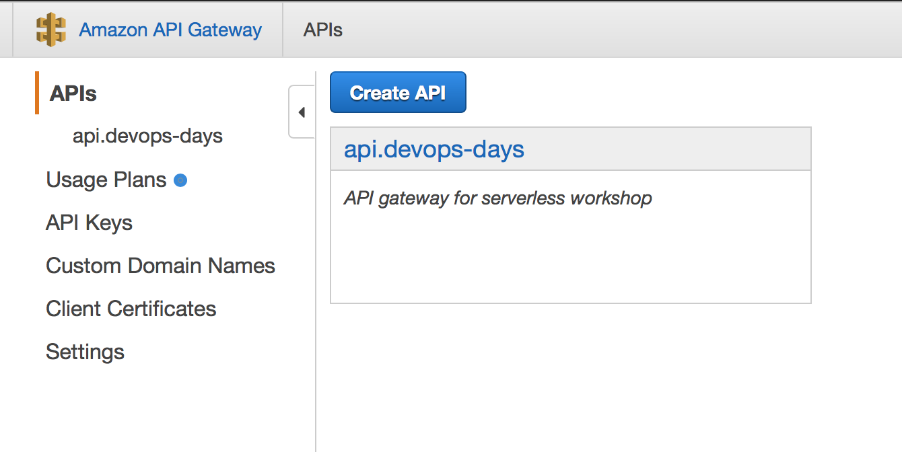

9. Then expand resources and click '/' -> GET -> `your-environment-01-new-game` -> ANY (all http methods)

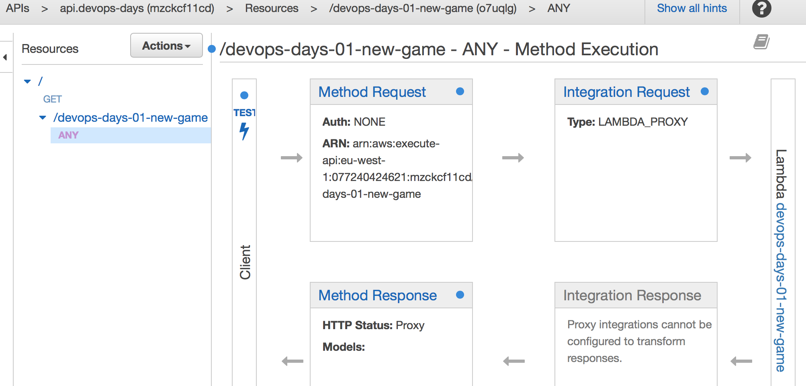

10. Click "Test" button near "Client" integration

11. Select *GET* method from the dropdown 

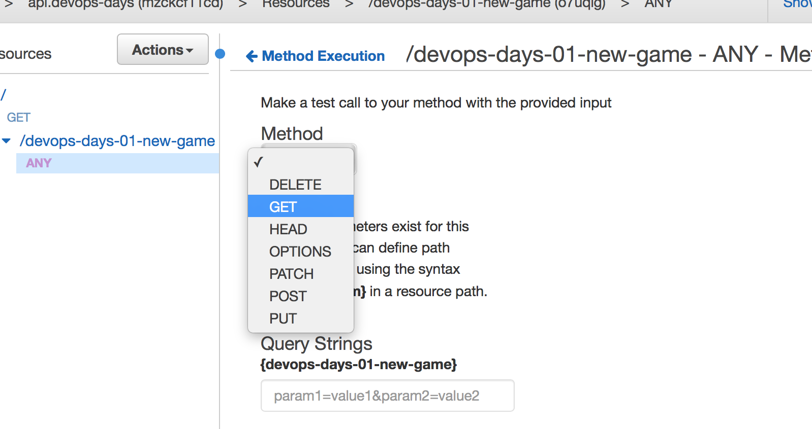

And click 'Test button'. In the AWS Lambda you will find following code

``` python
def response(body, event, code=200):
    # ...
    return {
        'statusCode': code,
        'headers': {},
        'body': json.dumps(body, separators=(',', ':')) 
      }
```

Let me explain this function. You probably noticed that AWS automatically generated LAMBDA-PROXY integration. This integration expects specific response. Otherwise API Gateway will throw a runtime error.

You must return:
* 'statuCode': integer value
* 'headers': or at least empty dictionary
* 'body': is a string (you your response to JSON and then convert it to the string)

At the same time. LAMBDA-PROXY integration also formalizes an incoming event format. It will always in the form 

```javascript
{
    "body": null,
    "resource": "/",
    "requestContext": {},
    "queryStringParameters": {},
    "httpMethod": "GET",
    "pathParameters": null,
    "headers": null,
    "stageVariables": null,
    "path": "/",
    "isBase64Encoded": false
}
```

Taking into account LAMBDA-PROXY integration limitations, it is still highly recommended if you stick with it. If you want more flexibility then you might want to revert to the LAMBDA integration. In this case you will need to specify itegration transformation template. For this purpose we recommend to use following template (or customize it if you want). This is most minimalistic form that will act like a LAMBDA-PROXY integration.

```javascript
#set($allParams = $input.params())
{
"body-json" : $input.json('$'),
"base64-body": "$util.base64Encode($input.body)",
"params" : {
#foreach($type in $allParams.keySet())
  #set($params = $allParams.get($type))
"$type" : {
  #foreach($paramName in $params.keySet())
  "$paramName" : "$util.escapeJavaScript($params.get($paramName))"
      #if($foreach.hasNext),#end
  #end
}
  #if($foreach.hasNext),#end
#end
},
"stage-variables" : {
#foreach($key in $stageVariables.keySet())
"$key" : "$util.escapeJavaScript($stageVariables.get($key))"
  #if($foreach.hasNext),#end
#end
},
"context" : {
  "account-id": "$context.identity.accountId",
  "api-id": "$context.apiId",
  "api-key": "$context.identity.apiKey",
  "authorizer-principal-id": "$context.authorizer.principalId",
  "caller": "$context.identity.caller",
  "cognito-authentication-provider":     "$context.identity.cognitoAuthenticationProvider",
  "cognito-authentication-type": "$context.identity.cognitoAuthenticationType",
  "cognito-identity-id": "$context.identity.cognitoIdentityId",
  "cognito-identity-pool-id": "$context.identity.cognitoIdentityPoolId",
  "http-method": "$context.httpMethod",
  "stage": "$context.stage",
  "source-ip": "$context.identity.sourceIp",
  "user": "$context.identity.user",
  "user-agent": "$context.identity.userAgent",
  "user-arn": "$context.identity.userArn",
  "request-id": "$context.requestId",
  "resource-id": "$context.resourceId",
  "resource-path": "$context.resourcePath"
  }
}
```

### LAB 02.1 Implement API Gateway to Lambda integration

Now for this activity let's proceed with all other functions and expose. You can proceed from LAMBDA to API GATEWAY (as we previously have done) or API GATEWAY to LAMBDA for maximum flexibility

Go back to API Gateway and create a Resource and a GET method to it

1. Select "Action" => "Create Resourse"

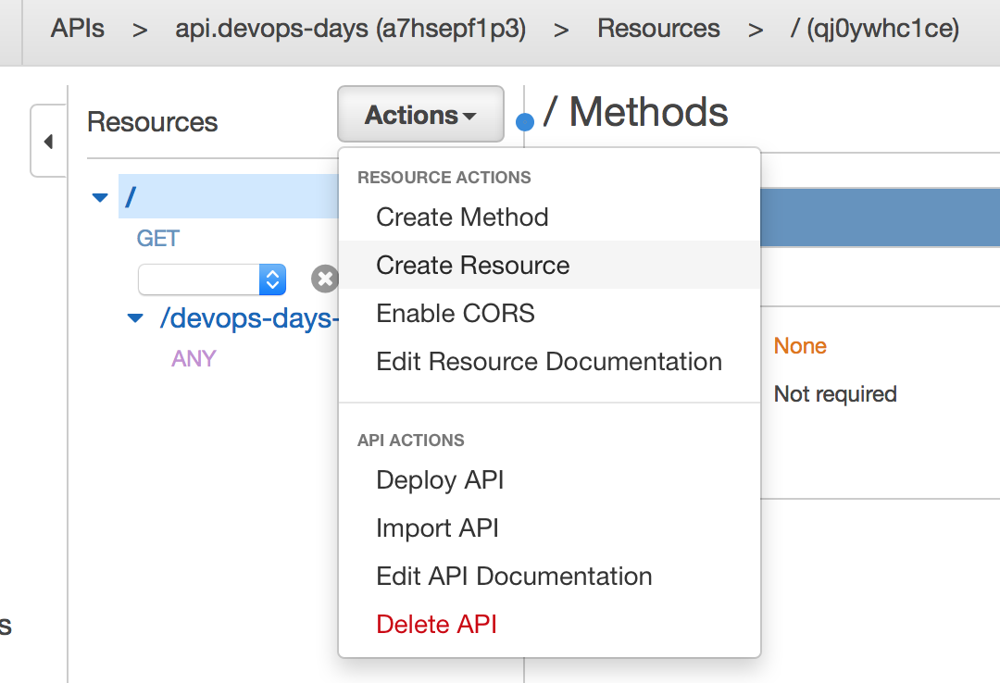

2. Fill "game-state" resource

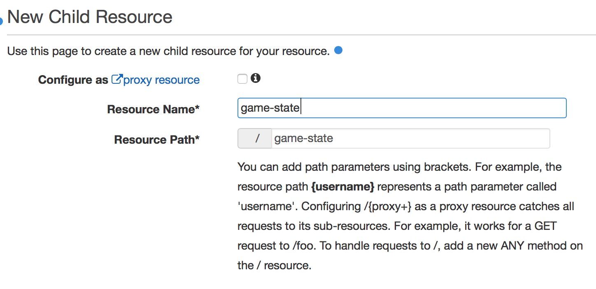

If you implement enpoint for AJAX request, then you might want to enable CORS (then don't forget to add OPTIONS method as per CORS specification). But we do not do it now

3. Let's add a new method to our recently created resource

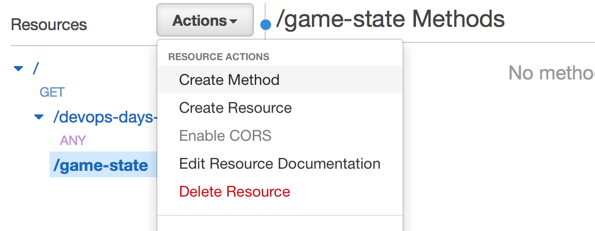

4. Select GET method and click "OK" round button


5. Select:

* Integration Type: Lambda Function
* Lambda Proxy Integration: `CHECKED` (for yes)
* Lambda Region: `eu-west-1` (or your region)
* Lambda Function: `your-environment-02-game-state`

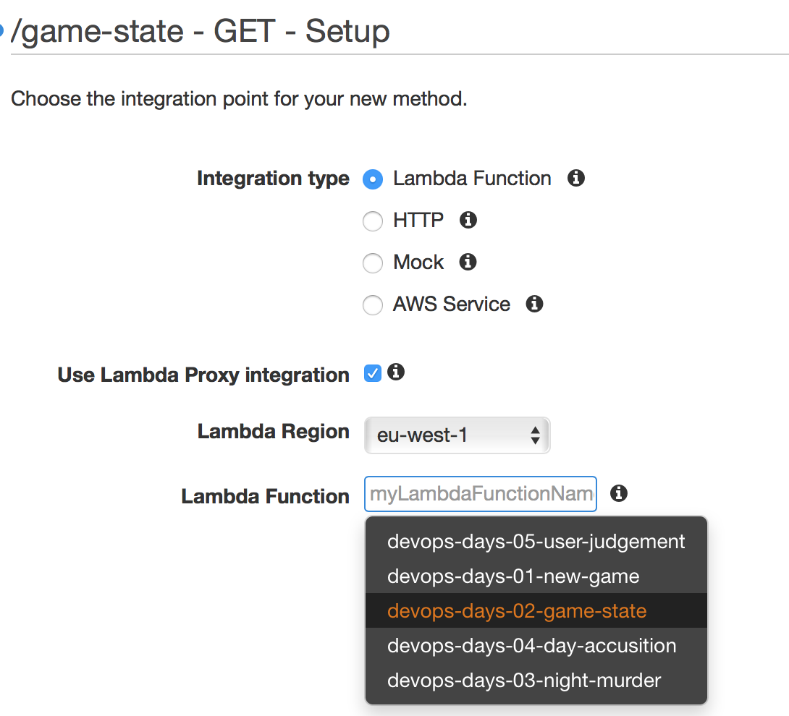

6. You will be prompted to confirm security settings

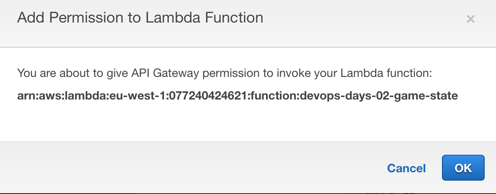

This will add Lambda trust relationship between API Gateway and Lambda function

### LAB 02.2 Implement API for all other functions

Now you should be able to complete integrations for all other functions at your pase


# Clean Up

To destroy your cloud resources, please run:
`make destroy`

