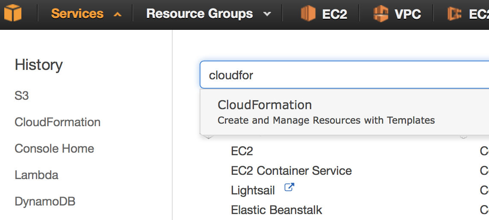
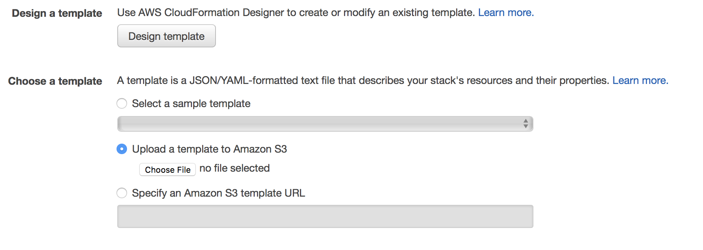
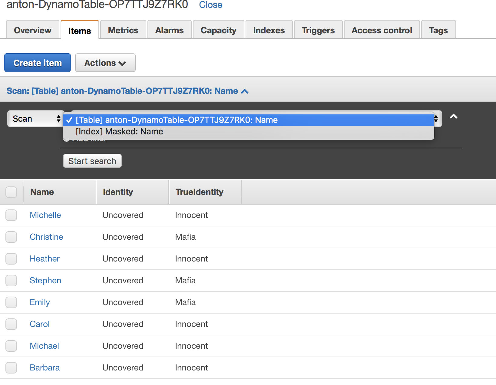

# Welcome

Welcome to the serverless workshop. Herer we will practice some common concepts of serverless architecture as well as review some of the common use cases

# What is Serverless

Core of serverless architectures is so called FaaS (Function as a Servie).
Which is a lightweight container that contains OS and Runtime and has been attached to the code baseline (FaaS code). Main benefit: it is only takes few milliseconds to spin up a new contaner instance that will execute code functioun attached to it. If it only takes few milliseconds why should we run it all the time? What if Cloud Provider will keep container disabled (you will not pay) and only spin it when certain event will happen and let the code inside of the container to react (be executed, triggered by event).

So, in difference to VMs you pay only for every 100milliseconds of execution instead of paying by hour. Sounds great, isn't it? Where is the catch? 

And yes there is a catch. Serverless Architecture comes with some limitations. So you need to think on architecture design how to dodge it. But, if ycan get savings up to 100 and more times if you design properly.

This workshop will highlight some of the AWS (They far are leading in serverless computing) Lamba service specifics and will give you possibility to try by yourself what works good what for you.

More details about Serverless you will get in the first Lab

# Tools we use

We need to have a comprehensive toolset of the tools to do development for serverless. We will use the following:

- *AWS*: cloud native services of Amazon Web Services. They are far behind of Google and Microsoft (in terms of maturity of cloud services for serverless )

- *CloudFormation*: This is an AWS service that can deploy whole stack as a single unit. In case of failure it should be able to roll it back as well.

- *Python 2.7*: You don't need to be an expert of Python to complete this workshop however some programming experience (any language is good) can be be efitial. We have choisen Python because it is easier to illustrate some of the FaaS concepts rather than other language runtimes (such as: nodejs or Java)

http://akranga.signin.aws.amazon.com/console?region=eu-west-1

# LAB - 0: prep the environment

There are two options how to use this workshop. 
1. Bring your own AWS. This will not going to cost you much. We estimate the whole workhop will cost less than 1USD. Your own cloud environment will guarantee that you are working on isolated from the other users environment wihtout risk of interference

2. User shared environment provided by us. Please be respectful to tother colleagues, don't kill other's stuff... Be careful to your's and it's all going to be just fine

If you use your own cloud then many steps from this tutororial can be skipped.

### Lab 00: Setting up the environment

1. With your Internet Browser. Connect to AWS Web Console [here](http://akranga.signin.aws.amazon.com/console?region=eu-west-1) or to your own Cloud Account.

2. Switch to the region Ireland (eu-west-1). Since now we will presume you are located in the Ireland region. All links will be to this region. If you decided to go to the other region, you might want to adjust direct links to your desired region.

3. Select CloudFormation Service. The easiest is to do to click on "Services" menu and enter in the search field "CloudFormation"


4. Click "CreateStack" big blue button

5. Next select "Upload a template to Amazon S3". To do this you need to clone current repository or store this CloudFormation template in your workstation and upload it with the browser. [Template File](cloudformation/stack.yaml)



6. Then please choose **"Stack name"** It must be unique per region. However you should be able to identify your stack later. Other parameters can be left unchanged

7. On the next pate, please check **"Advanced"** button. And **Rollback on failure** set to *No*

8. On the last screen please check **I acknowledge that AWS CloudFormation might create IAM resources.** Then you should be able to see how your stack has been progressing

9. Validate: your stack should become from **CREATE_IN_PROGRESS** to **CREATE_COMPLETE**. Then feel free to proceed to the **Lab 01**

### LAB 01: Getting started with AWS Lambda

1. With your Internet Browser. Connect to AWS Web Console [here](http://akranga.signin.aws.amazon.com/console?region=eu-west-1) or to your own Cloud Account.

2. Switch to the region Ireland (eu-west-1). Since now we will presume you are located in the Ireland region. All links will be to this region. If you decided to go to the other region, you might want to adjust direct links to your desired region.

3. Switch to AWS Lambda service: [direct link](https://eu-central-1.console.aws.amazon.com/lambda/home?region=eu-west-1)


4. Select lambda function that has been tagged as `your-environment-name-01-new-game` 


You will see several tabs. Let me guide through these it:
- *Code*: this tab shall be used to modify the code. Configuration management parameters can be injected via Environment Variables (scroll down)

- *Configuration*: This tab has been used to customize this Lambda function. Probably ost importaant text field is: Handler. It looks like the following: `main.new_game_handler`. Where, first part corresponds to the source code file name and second part is the name of the function to be executed.

Advanced settings also contains: RAM and Timeout constraints for this lambda function

- *Triggers*: here you can customize event source for the Lambda function (we will come back here in further Labs)

- *Monitoring*: contains reference to the LambdaFunction CloudWatch Logs. AWS Lmbda has no remote debugger functionality. So, logs become vitally important

On top left you will also find few buttons. Click on blue `Test` button. For the first time you should be able to see dialog to configure test event. It must be expressed in valid JSON format. Empty event looks like on the picture (`{}`) below. And then click "Save and Test" button (bottom right corner).


If execution has been completed successfully you shouls see. Result message, and function logs as well as used RAM and Function time statistics


### LAB 01.2: Modify behaviour of Lambda function

Knowing how to change code and test it, let's implement `new.handler` function. We should be able to create create a new game (gererate Players and assign Mafia identities to them). Because we don't want to reveal players identity to the User (remember Lambda is stateless) we are going to add backend database table to our AWS Lambda. We shall use it as cache to make sure our data survive Lambda container restart. But first let's start with the behavour of the `hanlder` function.

Before we start to do any changes let's add some code outside of `handler` function

```python
# all player names has been written in the text file
# we read all of them into list so later we can pick random
# to name our Players
with open('names.txt', 'r') as f:
  all_names = f.read().splitlines()

```

To begin game we need to choose some of the players names. These names has been written in the text file and `names.txt` code above will read them into the list

Because we will generate players for the game and write them into the databae (DynamoDB) we need to write a couple of functions for storage

```python

# deleate all records in the table
def clear_all():
  for i in table.scan()['Items']:
    table.delete_item(Key={'Name': i['Name']})

# save one record in the dynamo table
def save(player):
  table.put_item(Item=player)
```

Now is the most important. We need to write implementation of the so called `hamdler` funtion. This exactly function will be executed by lambda. Logic is quite sophisticated. Let me try to explain the algorithm 

1. We pick number of players and number of mafia players from the environment variables (injected by CloudFormation)
2. We pick several (number of players) of random names from the `names.txt` file.
3. We at random we choose (number of mafia) players and assign this identity as `TrueIdentity` attribute of the player
4. Other players will be `Innocent`
5. Attribute `Identity` will be by default `Uncovered`
6. We store everything in DynamoDB

```python
def handler(event, context):
  num_of_players = int(os.environ['NUMBER_OF_PLAYERS'])
  num_of_mafia   = int(os.environ['NUMBER_OF_MAFIA'])
  clear_all()

  names  = random.sample(all_names, num_of_players)
  mafia  = random.sample(range(0, num_of_players), num_of_mafia)

  for i in range(num_of_players):
    player = {
      'Name': names[i],
      'TrueIdentity': 'Mafia' if i in mafia else 'Innocent',
      'Identity':     'Uncovered'
    }
    save(player)

  message = "New game started with {}".format(', '.join(names))
  return response( {"message": message}, event )

```

Click `Save` button and then click `Test` button.

You should bet something like:
```javascript
{
  "message": "New game started with Christopher, Adam, Kevin, Brenda, Nicholas"
}
```
Where names are randomly selected player names. Few of them are `innocent` others hide `mafia` identity.

Let's add a database. If you will scroll down, you will find that Environment Variable `dynamo_table` has been set to the DynamoDB table name (that happend during provisioning with Terraform).

Let's initialize this table by placing code (just below log inicialization).
```python
log = logging.getLogger()
log.setLevel(logging.DEBUG)

dynamodb = boto3.resource('dynamodb')
table = dynamodb.Table(os.environ['DYNAMO_TABLE'])
```

Checking the data. We can switch to the `DynamoDB` service by following this [link](https://eu-west-1.console.aws.amazon.com/dynamodb/home?region=eu-west-1)

You can select DynamoDB service to check content of your table. Please be aware there might be other tables.


You can drill down to the data 


### LAB 01.2: Let's implement check state function

In a similar manner let's come back to our lambda functions [link](http://akranga.signin.aws.amazon.com/console?region=eu-west-1)


Now let's select function `your-environment-name-02-game-state`

Before we try to modify this function, let's make shure it works. Click "Test"button and end "empty" (`{}`) as Test Input Message. If you see the same  as on the screenshot below...


...then you feel free to proceed with this activity. Otherwise you might want to correct error first.

!!! Please apply same modifications as they were for for *LAB 01.1* and then add the following 

```python
# Scan and return all records of the game however hides true identity attribute
def handler(event, context):
  return table.scan()['Items']
```

This is probably the easiest modification. We need to scan all items in the table. 

Then click "Test". You shuld see function execution successfull otherwise you might want to correct an error.

```json
 {
    "TrueIdentity": "Innocent",
    "Name": "Michelle",
    "Identity": "Uncovered"
  },
  {
    "TrueIdentity": "Mafia",
    "Name": "Christine",
    "Identity": "Uncovered"
  },
  ...
]
```

Oops we accidentally leaked identity of the players. This makes this game pointless. However we do have a projection with the Secondary Index called `Masked`. You can test it in DynamoDB service

See screenshot:


Let's modify our lambda code so it would like the following

```python
# Scan and return all records of the game however hides true identity attribute
def handler(event, context):
  return table.scan(IndexName='Masked')['Items']
```

Then we should have no issues anymore. Click test to see:

```json
[
  {
    "Name": "Michelle",
    "Identity": "Uncovered"
  },
  {
    "Name": "Christine",
    "Identity": "Uncovered"
  },
  ...
]
```


### LAB 01.3: Add behavior to night-turn function

Based on what you learned in *LAB 01.1* and *LAB 01.2*
let's modify all other functions. (!!! Don't forget to propogate DB shared functions).

Do you remember game rules? During the night Mafia chooses victim among the innocent people and kills one of them. Mafia never kills their kind. Only innocent people. 

So, to start we need to write query to the dynamo 
```python

def find_by_identity(identity):
  return table.scan(
           FilterExpression=Attr('TrueIdentity').eq(identity) & 
                            Attr('Identity').eq('Uncovered')
          )['Items']
```

Let's also add save to database method
```python
def save(player):
  table.put_item(Item=player)
```

To remember result of mafia deeds.

Now we should be ready to apply our `handler` code

And Lambda implementation code:
```python
def handler(event, context):
  players = find_by_identity('Innocent')
  if len(players) == 0:
    return response( mafia_win_message(), event)

  victim  = random.choice(players)
  victim['Identity'] = 'Killed by mafia'

  save(victim)
  return response( {"Message": [
      "Night, time to sleep",
      "Mafia awakes",
      "Mafia kills {}".format(victim['Name']),
      "Mafia sleeps"
    ]}, event)
```

Upon successful execution you should see something like this
```javascript
{
  "Message": [
    "Night, time to sleep",
    "Mafia awakes",
    "Mafia kills Carol",
    "Mafia sleeps"
  ]
}
```


### LAB 01.4: Add behavior to day-turn function

During the day. Everybody makes a hypotesys who is the Mafia and makes accusations. Here are the rules:

1. Mafia knows true identities of each other and not accuse themselves. They point to Innocent
2. Innocent people don't know who is the Mafia and try to identify it
3. Players should agree about player to sentence. This will happen in the next turn.

Code of the function `your-environment-04-day-turn` looks very similar to previous one. As usual we start with the backend code

Very similar to previous ones:
```python
def find_all_uncovered():
  return table.scan(
           FilterExpression=Attr('Identity').eq('Uncovered')
          )['Items']


def find_by_identity(identity):
  return table.scan(
           FilterExpression=Attr('TrueIdentity').eq(identity) & 
                            Attr('Identity').eq('Uncovered')
          )['Items']
```

We need two function... That will fetch all 'Uncovered' or in the other words 'Living' players and another function to help mafia to filter `Mafia`  and leave `Innocent` people. Please note we do not use secondary index. Otherwise our we cannot lookup by `TrueIdentity` attribute

And now the `handler` code. Here is the sequence:

1. We lookup `Innocent` players among the "living"
2. We lookup all players
3. If `TrueIdentity` of a player is `Mafia` then they choose random person among `Innocent`. Otherwise among `Everybody`
4. So you see that probabily that people will blame innocent is bigger. This is how players can guess the Mafia. They never blame their kind.

```python
def handler(event, context): 
  message = [
    "Day, time to wake up!",
    "Players see the dead body and makes their accusations"
  ]

  innocent = find_by_identity('Innocent')
  anybody  = find_all_uncovered()

  for player in anybody:
    if player['TrueIdentity'] == 'Mafia':
      accused = random.choice(innocent)
    else:
      accused = random.choice(anybody)
    message.append("{} blames on {}".format(player['Name'], accused['Name']))

  message.append("Who is the Mafia?")
  return response({"Message": message}, event)
```


And successful execution result should look like this
```javascript
{
  "Message": [
    "Day, time to wake up!",
    "Players see the dead body and makes their accusations",
    "Michelle blames on Stephen",
    "Christine blames on Barbara",
    "Heather blames on Emily",
    "Stephen blames on Barbara",
    "Emily blames on Michael",
    "Michael blames on Stephen",
    "Barbara blames on Michelle",
    "Who is the Mafia?"
  ]
}
```

### LAB 01.5: Add behavior to judgement function

Select `your-environment-05-judgement` lambda function'

Last but not least. User will make a sentence. Then the player should uncover her `TrueIdentity` and leave the game.

User will pass the name of the player to sentence as input parameter. So, we will need to lookup `uncovered` by it's name. We also write `save` function to persist results of the sentence.

```python
def find_by_name(name):
  result = table.scan(
           FilterExpression=Attr('Identity').eq('Uncovered') &
                            Attr('Name').eq(name)
          )['Items']
  return result[0] if result else None

def save(player):
  table.put_item(Item=player)
```

User Parameter will come as user event a


```python
def handler(event, context):
  log.debug(json.dumps(event, separators=(',', ':')))

  name      = event['Name']
  sentenced = find_by_name(name)
  ...
```

Now in the test event we myst pass name
```javascript
{
  "Name": "John"
}
```

John might not be there... in this case we return `404` Not found

```python
  ...
  sentenced = find_by_name(name)
  if sentenced == None:
    return response({
        "Message": "Player with name {} not found".format(name)
      }, event, 404
    )
```

Check out for method `response`. It will be important for API Gateway integration

And now let's write our judgment logic below. If Player has been  found
```python
  if sentenced['TrueIdentity'] == 'Mafia':
    sentenced['Identity'] = 'Correctly sentenced'
    message = [
        'Mafia has been uncovered!',
        'Guilty member of mafia {} has been sentenced!'.format(sentenced['Name'])
      ]
  else:
    sentenced['Identity'] = 'Incorrectly sentenced'
    message = [
        'Mafia has not been uncovered!',
        'Innocent {} has been sentenced unfairly'.format(sentenced['Name'])
      ]
  
  save(sentenced)
  return response({"Message": message}, event)
```

TODO... As the bonus you might want to add some more logic to finish the game. Because now Mafia or Innocent people can win the game (killing all Innocent people or identifying all Mafia)

Look at the `night-turn` function for inspiration

Result might look like the following
```javascript
{
  "Message": [
    "Mafia has been uncovered!",
    "Guilty member of mafia Christine has been sentenced!"
  ]
}
```

# LAB 2 Create an API

We created few AWS Lambdas now let's expose it to the users so they can access it. For this purpose we need an API Gateway Service that will encapsulate AWS lambdas behind REST interface and will privide convinient endpoints

With our terraform script. We already created an instance of AWS API Gateway

We will use only `open` (unsecured) endpoints today.

Before we start just check your API ednpoint name

Run following command

```
$ make out

Outputs:

api_gateway_name = api.devops-days
api_gateway_url = https://mzckcf11cd.execute-api.eu-west-1.amazonaws.com/prod
```

1. Go to AWS Lambda service: [direct link](https://eu-central-1.console.aws.amazon.com/lambda/home?region=eu-west-1)

2. Select lambda function that has been tagged as `your-environment-name-01-new-game` 


3. Switch to 'Triggers' tab and press "Add new trigger"

4. Click on "dotted square" on the left from AWS Lambda icon (see screenshot below) and select API Gateway


5. In the new dialog:
    * API name: select your API gateway (terraform output should help to find your).
    * Deployment stage: prod
    * Security: open


6. By the completion of this step you should see someting like below:


7. Now switch to API Gateway service: [link](https://eu-west-1.console.aws.amazon.com/apigateway/home?region=eu-west-1#/apis)

8. Select your API


9. Then expand resources and click '/' -> GET -> `your-environment-01-new-game` -> ANY (all http methods)


10. Click "Test" button near "Client" integration

11. Select *GET* method from the dropdown 


And click 'Test button'. In the AWS Lambda you will find following code

``` python
def response(body, event, code=200):
    # ...
    return {
        'statusCode': code,
        'headers': {},
        'body': json.dumps(body, separators=(',', ':')) 
      }
```

Let me explain this function. You probably noticed that AWS automatically generated LAMBDA-PROXY integration. This integration expects specific response. Otherwise API Gateway will throw a runtime error.

You must return:
* 'statuCode': integer value
* 'headers': or at least empty dictionary
* 'body': is a string (you your response to JSON and then convert it to the string)

At the same time. LAMBDA-PROXY integration also formalizes an incoming event format. It will always in the form 

```javascript
{
    "body": null,
    "resource": "/",
    "requestContext": {},
    "queryStringParameters": {},
    "httpMethod": "GET",
    "pathParameters": null,
    "headers": null,
    "stageVariables": null,
    "path": "/",
    "isBase64Encoded": false
}
```

Taking into account LAMBDA-PROXY integration limitations, it is still highly recommended if you stick with it. If you want more flexibility then you might want to revert to the LAMBDA integration. In this case you will need to specify itegration transformation template. For this purpose we recommend to use following template (or customize it if you want). This is most minimalistic form that will act like a LAMBDA-PROXY integration.

```javascript
#set($allParams = $input.params())
{
"body-json" : $input.json('$'),
"base64-body": "$util.base64Encode($input.body)",
"params" : {
#foreach($type in $allParams.keySet())
  #set($params = $allParams.get($type))
"$type" : {
  #foreach($paramName in $params.keySet())
  "$paramName" : "$util.escapeJavaScript($params.get($paramName))"
      #if($foreach.hasNext),#end
  #end
}
  #if($foreach.hasNext),#end
#end
},
"stage-variables" : {
#foreach($key in $stageVariables.keySet())
"$key" : "$util.escapeJavaScript($stageVariables.get($key))"
  #if($foreach.hasNext),#end
#end
},
"context" : {
  "account-id": "$context.identity.accountId",
  "api-id": "$context.apiId",
  "api-key": "$context.identity.apiKey",
  "authorizer-principal-id": "$context.authorizer.principalId",
  "caller": "$context.identity.caller",
  "cognito-authentication-provider":     "$context.identity.cognitoAuthenticationProvider",
  "cognito-authentication-type": "$context.identity.cognitoAuthenticationType",
  "cognito-identity-id": "$context.identity.cognitoIdentityId",
  "cognito-identity-pool-id": "$context.identity.cognitoIdentityPoolId",
  "http-method": "$context.httpMethod",
  "stage": "$context.stage",
  "source-ip": "$context.identity.sourceIp",
  "user": "$context.identity.user",
  "user-agent": "$context.identity.userAgent",
  "user-arn": "$context.identity.userArn",
  "request-id": "$context.requestId",
  "resource-id": "$context.resourceId",
  "resource-path": "$context.resourcePath"
  }
}
```

### LAB 02.1 Implement API Gateway to Lambda integration

Now for this activity let's proceed with all other functions and expose. You can proceed from LAMBDA to API GATEWAY (as we previously have done) or API GATEWAY to LAMBDA for maximum flexibility

Go back to API Gateway and create a Resource and a GET method to it

1. Select "Action" => "Create Resourse"


2. Fill "game-state" resource


If you implement enpoint for AJAX request, then you might want to enable CORS (then don't forget to add OPTIONS method as per CORS specification). But we do not do it now

3. Let's add a new method to our recently created resource


4. Select GET method and click "OK" round button


5. Select:

* Integration Type: Lambda Function
* Lambda Proxy Integration: `CHECKED` (for yes)
* Lambda Region: `eu-west-1` (or your region)
* Lambda Function: `your-environment-02-game-state`


6. You will be prompted to confirm security settings


This will add Lambda trust relationship between API Gateway and Lambda function

### LAB 02.2 Implement API for all other functions

Now you should be able to complete integrations for all other functions at your pase


# Clean Up

To destroy your cloud resources, please run: Go to CloudFormation service  and delete your stack


Thank you!!!

